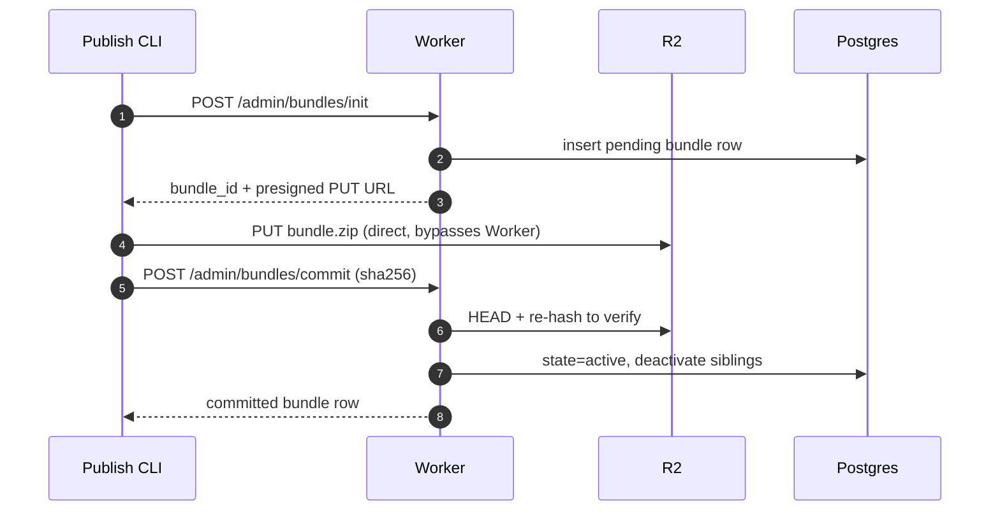
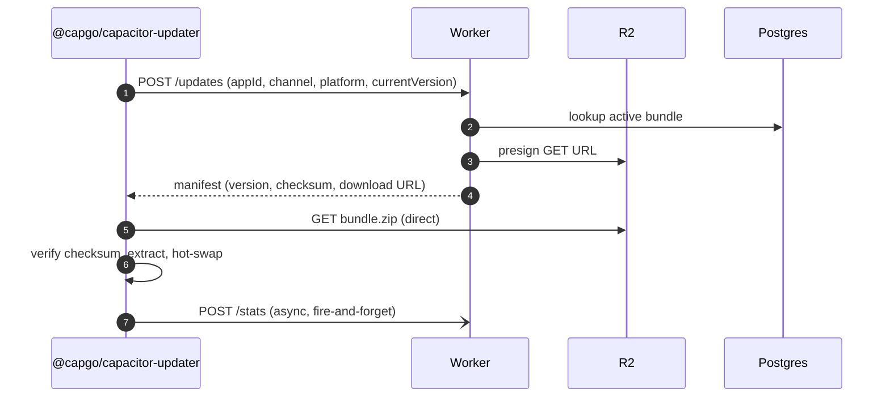

# capgo-update-lite

Self-hostable OTA update server for [`@capgo/capacitor-updater`](https://github.com/Cap-go/capacitor-updater). The official self-hosted stack pulls in Supabase, optional Workers, and a lot of other moving parts. This project is one Cloudflare Worker plus one Postgres, with an almost-automatic deploy.

[](https://deploy.workers.cloudflare.com/?url=https://github.com/Kage0x3B/capgo-update-lite/tree/main/packages/app)
[](./packages/cli/LICENSE)

## Features

- **Drop-in replacement** for capgo.app's hosted service or their sprawling self-hosted backend. Devices hit the same `/updates` and `/stats` endpoints the plugin already expects.
- **Channel-scoped rollouts.** Use `production`, `staging`, `canary`, whatever you want; devices only see bundles whose channel matches their `defaultChannel`.
- **Web dashboard** at `/dashboard`. Manage apps and bundles, review usage stats and update failures reported by devices.
- **Publish CLI** at `pnpx capgo-update-lite-cli`. Ships new bundles, manages apps and bundles, and inspects stats from the terminal.
- **Runs on Cloudflare + R2 free tiers** for low-traffic apps. Bring your own Postgres.

## Quickstart: one-click deploy

Click **Deploy to Cloudflare** above. The wizard:

1. Forks this repo into your GitHub account.
2. Provisions an R2 bucket for the `BUNDLES` binding.
3. Prompts you for a Postgres connection string, creates a Hyperdrive binding, replaces the placeholder id in `wrangler.jsonc`.
4. Builds the SvelteKit worker and deploys.

Before clicking "Deploy", open **Advanced settings** and add a build-time variable named `PRIVATE_ADMIN_TOKEN`. That token gates `/admin/*` and the dashboard login; it's consumed via `$env/static/private` at build time, so it has to be set before the build runs (not via `wrangler secret put`). Generate one with:

```sh
openssl rand -hex 16
```

Four follow-ups after the first deploy. The worker will log errors (and the cron jobs will refuse to run) until they're done:

1. **Apply the DB schema.** Run `pnpm db:push`. Details: [Postgres + Drizzle setup](#postgres--drizzle-setup).
2. **Set the R2 secrets.** Mint an R2 API token, then `wrangler secret put` three values. Details: [R2 + CORS setup](#r2--cors-setup).
3. **Apply R2 CORS.** Paste a small JSON blob into the R2 dashboard or run `wrangler r2 bucket cors put`. Details: [R2 + CORS setup](#r2--cors-setup).
4. **Set `CRON_SECRET`.** `wrangler secret put CRON_SECRET` (`openssl rand -hex 16`). Required for the scheduled cleanup jobs to run. Details: [Scheduled cleanup](#scheduled-cleanup-cron-triggers).

Then wire up your Capacitor app (see [Client setup](#client-setup-capacitor-app-side)) and register your first app via the dashboard or `pnpx capgo-update-lite-cli apps add`.

## Manual setup (non-button path)

**Prerequisites:** Cloudflare account, a Postgres you own, `pnpm`, Node 20+.

```sh
git clone https://github.com/Kage0x3B/capgo-update-lite.git
cd capgo-update-lite
pnpm install

# Replace the placeholder Hyperdrive id with your own (dashboard →
# Workers & Pages → Hyperdrive → your binding → ID).
vim packages/app/wrangler.jsonc

# Fill in the Postgres URL + PRIVATE_ADMIN_TOKEN + R2 creds.
cp packages/app/.env.example      packages/app/.env
cp packages/app/.dev.vars.example packages/app/.dev.vars
vim packages/app/.env packages/app/.dev.vars

pnpm db:push     # apply schema to your Postgres
pnpm deploy      # vite build + wrangler deploy
```

After the first deploy, run the post-deploy steps from the quickstart (R2 secrets, CORS, and `CRON_SECRET`; the `db:push` above already handled the schema).

## Postgres + Drizzle setup

### 1. Pick a Postgres host

- **Self-hosted.** A `postgres:18-alpine` container on a Hetzner (or equivalent) VPS is enough; any Postgres 14+ works.
    - Hyperdrive connects with `sslmode=require`, so Postgres must be configured to accept SSL connections.
- **Managed Postgres.** Any Hyperdrive-compatible provider works:
    - [Neon](https://neon.tech)
    - [Render](https://render.com)
    - See Cloudflare's [full list of compatible providers](https://developers.cloudflare.com/hyperdrive/reference/supported-databases-and-features/#supported-database-providers).

### 2. Create a Hyperdrive binding

Cloudflare dashboard → Workers & Pages → Hyperdrive → **Create configuration** → paste your Postgres connection string. Copy the resulting binding ID.

If you're using the Deploy to Cloudflare button, paste the ID into the wizard's `HYPERDRIVE` prompt during setup; Cloudflare writes it into the forked repo's `wrangler.jsonc` for you.

For a manual deploy, paste the ID into `packages/app/wrangler.jsonc` yourself:

```jsonc
"hyperdrive": [
    { "binding": "HYPERDRIVE", "id": "<your-hyperdrive-id>" }
]
```

### 3. Apply the schema

```sh
pnpm db:push       # fastest path for first-time setup
```

Schema source: [`packages/app/src/lib/server/db/schema.ts`](./packages/app/src/lib/server/db/schema.ts), defining four tables (`apps`, `bundles`, `stats_events`, `admin_tokens`). Existing migration SQL lives under `packages/app/drizzle/`.

## R2 + CORS setup

The dashboard uploads bundles directly to presigned R2 URLs from the browser. Without a CORS policy on the bucket, those PUTs fail with a cross-origin error.

### 1. Mint an R2 API token

Cloudflare dashboard → R2 → Manage R2 API Tokens → **Create API token**. Scope it to the bundles bucket (read + write). Note the **Access Key ID**, **Secret Access Key**, and the **S3 API endpoint URL** shown after creation.

### 2. Set the three secrets

```sh
wrangler secret put R2_S3_ENDPOINT        # https://<account-id>.<region>.r2.cloudflarestorage.com
wrangler secret put R2_ACCESS_KEY_ID
wrangler secret put R2_SECRET_ACCESS_KEY
```

### 3. Apply the CORS policy

Use this rule set, replacing `https://my-update-server.example.com` with the public URL of your deployed dashboard:

```json
[
    {
        "AllowedOrigins": ["https://my-update-server.example.com"],
        "AllowedMethods": ["PUT"],
        "AllowedHeaders": ["content-type"],
        "ExposeHeaders": ["etag"],
        "MaxAgeSeconds": 3600
    }
]
```

In the Cloudflare dashboard, go to R2 → your bucket → Settings → CORS Policy and paste the JSON.

Alternatively, from the CLI, save the JSON as `cors.json` and run (omit `--jurisdiction` if your bucket isn't in the EU jurisdiction):

```sh
wrangler r2 bucket cors put <your-bucket-name> --rules ./cors.json --jurisdiction eu
```

## Scheduled cleanup (cron triggers)

The Worker registers two Cloudflare Cron Triggers (declared in [`wrangler.jsonc`](./packages/app/wrangler.jsonc) under `triggers.crons`):

| Schedule                       | Job             | Behavior                                                                                                                                 |
| ------------------------------ | --------------- | ---------------------------------------------------------------------------------------------------------------------------------------- |
| `0 3 * * *` (daily, 03:00 UTC) | `prune-stats`   | Deletes `stats_events` older than `STATS_RETENTION_DAYS` (default 90, set 0 to disable).                                                 |
| `0 * * * *` (hourly)           | `prune-orphans` | Deletes `bundles` rows still in `state='pending'` after 24h (init→commit flows that never completed) and their R2 objects (best-effort). |

Both jobs are gated by `CRON_SECRET`. Set it once after deploy:

```sh
wrangler secret put CRON_SECRET   # paste an `openssl rand -hex 16`
```

Without it, every scheduled invocation logs `[cron] CRON_SECRET not set — refusing to run` and the job is skipped. The actual prune logic lives behind regular HTTP routes (`/cron/prune-stats`, `/cron/prune-orphans`); the snippet appended to `_worker.js` by [`cron/append.mjs`](./packages/app/cron/append.mjs) just fires synthetic requests at them.

## Client setup (Capacitor app side)

Install the plugin in your Capacitor project:

```sh
pnpm add @capgo/capacitor-updater
pnpx cap sync
```

Point the plugin at your deployed worker in `capacitor.config.ts`:

```ts
import type { CapacitorConfig } from '@capacitor/cli';

const config: CapacitorConfig = {
    appId: 'com.example.app',
    appName: 'Example',
    plugins: {
        CapacitorUpdater: {
            updateUrl: 'https://<my-update-server.example.com>/updates',
            statsUrl: 'https://<my-update-server.example.com>/stats',
            defaultChannel: 'production'
        }
    }
};

export default config;
```

> The `appId` must match the one you register via `POST /admin/apps`. The CLI's preflight checks this automatically for you.

For the full plugin API (triggering update checks manually, listening for lifecycle events, handling rollbacks, channel overrides, encrypted bundles), see the upstream docs: <https://github.com/Cap-go/capacitor-updater>.

## Publishing updates

### 1. Register the app (once)

Through the dashboard (`/dashboard/apps`) or the CLI:

```sh
pnpx capgo-update-lite-cli apps add com.example.app --name "Example"
```

### 2. Build your web assets

Produce whatever Capacitor expects, typically a `build/` or `www/` directory with `index.html` at the root. The CLI's preflight rejects builds containing Cloudflare adapter artifacts (`_worker.js`, `_routes.json`), which catches the common mistake of pointing at a SvelteKit `.svelte-kit/cloudflare` directory instead of the Capacitor build.

### 3. Publish with the CLI

Scaffold a project config once:

```sh
pnpx capgo-update-lite-cli init
# edits capgo-update.config.json — set appId / serverUrl / channel / distDir, commit it
```

Then ship a bundle whenever your web build is fresh:

```sh
pnpx capgo-update-lite-cli publish
```

That's the whole command. The bundle version is read from `package.json`; if it matches the bundle currently active on the channel, the CLI prompts for a `patch`/`minor`/`major` bump and writes the new value back to `package.json` before publishing. Native min-build floors are auto-detected from `android/app/build.gradle` and `ios/App/App/Info.plist` (the iOS resolver follows `$(MARKETING_VERSION)` through `project.pbxproj` → xcconfig → `xcodebuild` automatically). To override any of this, pass the matching flag (`--bundle-version`, `--min-android-build`, `--min-ios-build`, `--channel`, …).

Auth has three routes (pick whichever suits your environment): `--admin-token <token>`, `CAPGO_ADMIN_TOKEN` env, or an `adminToken` key in `capgo-update.config.json`. Same precedence ladder for every option: CLI flag > `CAPGO_*` env > JSON config > default.

### CLI subcommand summary

| Subcommand                            | Purpose                                                                                |
| ------------------------------------- | -------------------------------------------------------------------------------------- |
| `publish`                             | Zip a dist directory and ship it as a bundle (init → R2 PUT → commit).                 |
| `apps list` / `add` / `set-policy`    | List registered apps; register a new one; update compatibility policy.                 |
| `bundles list` / `delete` / `promote` | Inspect bundles, soft / hard-delete (`--purge`), promote a previous version to active. |
| `probe`                               | Smoke-test `POST /updates` with a synthetic device request.                            |
| `stats`                               | List recent stats events, filterable by app / action / time window.                    |
| `init`                                | Scaffold a `capgo-update.config.json` config file.                                     |

### Channels and rollback

Devices only receive bundles whose channel matches their plugin's `defaultChannel`. Publish to `staging` first:

```sh
pnpx capgo-update-lite-cli publish --channel staging
```

To roll back, promote an older bundle via the dashboard (`/dashboard/apps/<id>`) or the CLI:

```sh
pnpx capgo-update-lite-cli bundles promote 1.1.0 --app com.example.app
```

Activation is atomic: it deactivates siblings in the same `(appId, channel)` in the same transaction, so there's no window where two bundles are both "active".

See [`packages/cli/README.md`](./packages/cli/README.md) for the full flag reference, preflight check list, and JSON config file format.

## Dashboard + API

- **`/dashboard`**: web UI. Log in with your `PRIVATE_ADMIN_TOKEN` or any token issued via `/dashboard/admin/tokens`.
- **`/updates`, `/stats`**: plugin-facing routes that match the `@capgo/capacitor-updater` server spec.
- **`/health`**: liveness / readiness probe.
- **`/admin/*`**: admin routes consumed by the CLI (bearer auth).
- **`/openapi.json`** and **`/docs`**: OpenAPI spec and a Scalar-rendered UI.

## Auth model

There are two ways to authenticate with `/admin/*` and the dashboard:

1. **`PRIVATE_ADMIN_TOKEN`** — the build-time secret. Always treated as a `admin`-role super-admin and bypasses the database entirely. Set it in `.env` (or the Cloudflare build-time variable). Rotating it invalidates every issued dashboard session.
2. **DB-backed admin tokens** — issued via `/dashboard/admin/tokens` (admin role only). Each token has a role; the plaintext is shown exactly once on creation, only `sha256(plaintext)` is stored.

### Roles

| Role        | Can do                                                                                                         |
| ----------- | -------------------------------------------------------------------------------------------------------------- |
| `viewer`    | Read-only dashboard + `GET` admin endpoints. No mutations.                                                     |
| `publisher` | Viewer + bundle CRUD: publish (`POST /admin/bundles/init` + `commit`), edit, soft-delete, promote, reactivate. |
| `admin`     | Full access: app CRUD, per-app policy, token management.                                                       |

CI pipelines should use `publisher` tokens. Reserve `admin` for humans operating the dashboard or rotating tokens.

### Revocation

Revoking a DB-backed token from the dashboard takes effect immediately for new requests, but existing dashboard sessions issued from that token stay valid until expiry (the cookie is HMAC'd with `PRIVATE_ADMIN_TOKEN`, not the user's token). To force a global logout, rotate `PRIVATE_ADMIN_TOKEN`.

## How it works

Bundle bytes never transit the Worker's request body. Uploads and downloads go through presigned R2 URLs, so the Worker's 100 MB request-size cap doesn't apply; it only handles small JSON payloads (manifests, commit metadata, stats events).

### Publishing a bundle



### Checking for updates (on-device)



## Configuration reference

### Environment variables

| Name                      | Where                                                   | Purpose                                                                                   |
| ------------------------- | ------------------------------------------------------- | ----------------------------------------------------------------------------------------- |
| `PRIVATE_ADMIN_TOKEN`     | `.env` (build-time; baked in via `$env/static/private`) | Bootstrap super-admin bearer token for `/admin/*` + dashboard login. Always role `admin`. |
| `R2_S3_ENDPOINT`          | `wrangler secret put`                                   | R2 S3-compatible endpoint URL                                                             |
| `R2_ACCESS_KEY_ID`        | `wrangler secret put`                                   | R2 API token access key                                                                   |
| `R2_SECRET_ACCESS_KEY`    | `wrangler secret put`                                   | matching secret                                                                           |
| `R2_DOWNLOAD_TTL_SECONDS` | `wrangler secret put` (optional)                        | Lifetime of presigned bundle GET URLs handed to devices. Default 3600 (1h).               |
| `STATS_RETENTION_DAYS`    | `wrangler secret put` (optional)                        | Days of `stats_events` history to keep. Default 90. Set to 0/empty to disable pruning.    |
| `CRON_SECRET`             | `wrangler secret put` (required for cron)               | Bearer token for the internal `/cron/[job]` endpoint. Without it, scheduled jobs no-op.   |

### Wrangler bindings

Defined in [`packages/app/wrangler.jsonc`](./packages/app/wrangler.jsonc):

| Binding      | Kind         | Purpose                                                                                           |
| ------------ | ------------ | ------------------------------------------------------------------------------------------------- |
| `ASSETS`     | `assets`     | Serves the SvelteKit client bundle from `.svelte-kit/cloudflare`.                                 |
| `HYPERDRIVE` | `hyperdrive` | Connection pool to your Postgres.                                                                 |
| `BUNDLES`    | `r2_bucket`  | Declared so the Deploy wizard creates the bucket; server talks to R2 via S3 API (presigned URLs). |

## License

MIT. See [`packages/cli/LICENSE`](./packages/cli/LICENSE); the server code under `packages/app/` is covered under the same terms.
